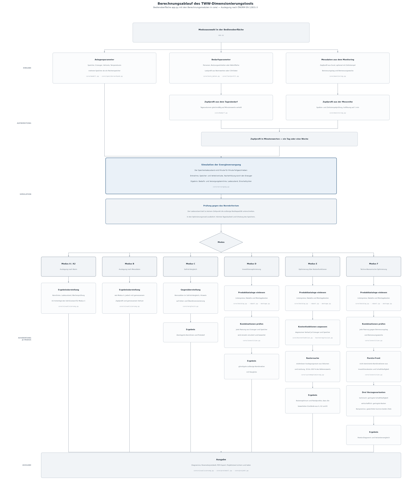

# Dimensionierung von Trinkwarmwasseranlagen nach ÖNORM EN 12831-3

## Überblick

Dieses Repository enthält ein Auslegungs- und Optimierungswerkzeug für
Trinkwarmwasseranlagen (TWW) mit Wärmepumpe und Speicher, entwickelt im Rahmen
einer Masterthesis.

Kern des Werkzeugs ist der minutenweise Algorithmus zur Bestimmung der
Energieversorgungskennlinie nach ÖNORM EN 12831-3, Abschnitt 6.4.3.3. Darauf
aufbauend beantwortet das Werkzeug zwei Fragen:

- **Trägt eine vorgegebene Anlage?** Nachweis über das Normkriterium, dass der
  Speicherladezustand zu keinem Zeitpunkt unter die zulässige Restkapazität
  fällt.
- **Welche Anlage ist die günstigste, die trägt?** Optimierung über reale
  Katalogprodukte beziehungsweise über daraus abgeleitete Kostenfunktionen.

Die Bedienung erfolgt über eine Streamlit-Oberfläche im Browser.

## Zielsetzung

- Auslegung nach Norm und Auslegung nach gemessenem Verbrauch gegenüberstellen
- den Einfluss von Speichergröße und Erzeugerleistung auf die Investitionskosten
  sichtbar machen
- technische und wirtschaftliche Ziele über eine Pareto-Front abwägen, statt sie
  vorab zu einer Kennzahl zu verrechnen

## Berechnungsmodi

Die Modi A bis C **bewerten** eine vom Anwender vorgegebene Anlage, die Modi D
bis F **suchen** eine Anlage.

| Modus | Aufgabe |
|---|---|
| **A** | Normauslegung mit einem Lastprofil nach Anhang B.1 |
| **B** | Auslegung mit einem gemessenen Zapfprofil aus Monitoringdaten |
| **C** | Gegenüberstellung Norm (Soll) gegen Monitoring (Ist) für dieselbe Anlage |
| **D** | Investitionsoptimierung über reale Katalogprodukte |
| **E** | Optimierung über degressive Kostenfunktionen auf kontinuierlichem Raster |
| **F** | Techno-ökonomische Optimierung: minimale Schalthäufigkeit, minimale Investitionskosten und gewichteter Kompromiss auf der Pareto-Front |

Ausführliche Beschreibung: [`dokumentation/`](dokumentation/).

### Methodische Grundlagen der Optimierung

Der Rechengang von Modus A bis C folgt der ÖNORM EN 12831-3. Die
Mehrzieloptimierung in Modus E und F — Dominanzkriterium, A-priori-Skalarisierung
über die Kostenfunktion, gewichtete Summe über Min-Max-normierte Ziele und
lexikographische Reihung — stützt sich auf:

- R. Marler und J. Arora, „Survey of multi-objective optimization methods for
  engineering", *Structural and Multidisciplinary Optimization*, 26(6),
  369–395, 2004. DOI: [10.1007/s00158-003-0368-6](https://doi.org/10.1007/s00158-003-0368-6)
- E. Halser, E. Finhold, N. Leithäuser, P. Süss und K.-H. Küfer, „Pareto
  navigation for multicriteria building energy supply design", *Applied
  Energy*, 371, 123651, 2024. DOI: [10.1016/j.apenergy.2024.123651](https://doi.org/10.1016/j.apenergy.2024.123651)

Welcher Schritt sich auf welche Fundstelle bezieht, steht in
[`dokumentation/Optimierungsalgorithmus.md`](dokumentation/Optimierungsalgorithmus.md),
Abschnitt 5.4.

## Was dieses Repository nicht enthält

Zwei Bestandteile sind bewusst ausgenommen:

**Die Werte aus Anhang B der ÖNORM EN 12831-3.** Die Norm ist
urheberrechtlich geschützt und kostenpflichtig zu beziehen; ihre Tabellenwerke
dürfen nicht weitergegeben werden. Im Repository liegt daher nur
[`core/norm_werte_vorlage.py`](core/norm_werte_vorlage.py) — eine Vorlage mit
frei erfundenen Platzhaltern, in die Anwender die Werte aus ihrem eigenen
Normexemplar eintragen. Der Rechengang selbst, also die Umsetzung der
Gleichungen und des Simulationsalgorithmus, ist vollständig enthalten.

**Die Hersteller-Preiskataloge und die Monitoringdaten.** Beide enthalten
Geschäfts- beziehungsweise Gebäudedaten. Das Werkzeug liest sie zur Laufzeit aus
Excel-Dateien ein, die der Anwender selbst bereitstellt.

Solange keine Normwerte hinterlegt sind, rechnet das Werkzeug mit den
Platzhaltern der Vorlage und weist in der Oberfläche sowie in jedem
Ergebnisprotokoll darauf hin, dass die Ergebnisse **nicht normkonform** sind.

## Installation und Start

Vorausgesetzt wird Python 3.11 oder neuer; entwickelt und gerechnet wurde mit
Python 3.14.

```bash
git clone https://github.com/gt24m013/tww-dimensionierung-en12831-3-MGT2026.git
cd tww-dimensionierung-en12831-3-MGT2026
python -m venv .venv
.venv\Scripts\activate
pip install -r requirements.txt
streamlit run app.py
```

Unter Linux und macOS lautet die vierte Zeile `source .venv/bin/activate`.

### Eigene Normwerte hinterlegen

```bash
Copy-Item core/norm_werte_vorlage.py core/norm_werte_lokal.py
```

Anschließend in der Kopie die Platzhalter durch die Werte aus dem eigenen
Normexemplar ersetzen und `IST_NORMKONFORM = True` setzen. Die Datei ist über
`.gitignore` von der Versionsverwaltung ausgenommen. Eine Schritt-für-Schritt-
Anleitung steht im Kopf der Vorlage.

Einzelne Lastprofile lassen sich alternativ zur Laufzeit als CSV-Datei laden
(Seitenleiste, „Lastprofil aus CSV laden"). Format und Beispiel:
[`beispiele/`](beispiele/).

## Projektstruktur

```
├── app.py                      → Streamlit-Oberfläche, alle sechs Modi
├── core/
│   ├── modell.py               → Eingabedatenmodell
│   ├── norm_daten.py           → Zugriff auf die Anhang-B-Werte
│   ├── norm_werte_vorlage.py   → Vorlage für die eigenen Normwerte
│   ├── bedarf.py               → Tagesbedarf und Zapfprofil (Gl. 20/21, Anhang B)
│   ├── versorgung.py           → Speicher, Verluste, Versorgungskennlinie (Gl. 4–17)
│   ├── lastprofil.py           → CSV-Import eigener Lastprofile
│   ├── monitoring.py           → Einlesen gemessener Zapfprofile
│   ├── vergleich.py            → Gegenüberstellung Norm gegen Monitoring
│   ├── speicherverbund.py      → mehrere Speicher als ein Rechenspeicher
│   ├── katalog.py              → Einlesen der Produktkataloge
│   ├── rabatt.py               → Rabatte auf Listenpreise
│   ├── montage.py              → Montagekosten
│   ├── kostenfunktion.py       → degressive Kostenfunktionen (Potenzansatz)
│   ├── kostenregression.py     → Regressionen je Hersteller zur Prüfung
│   ├── investition.py          → Investitionsoptimierung (Modus D)
│   ├── systemoptimierung.py    → Optimierung über Kostenfunktionen (Modus E)
│   ├── projekt.py              → Speichern und Laden von Projektständen
│   ├── protokoll.py            → Parameterprotokoll der Ergebnisse
│   └── visualisierung.py       → Diagramme
├── tests/                      → Testfälle (pytest)
├── dokumentation/              → Beschreibung der Modi und des Optimierungsalgorithmus
├── abbildungen/                → Programmstruktur als Ablaufdiagramm
└── beispiele/                  → Beispiel-Lastprofil und Formatbeschreibung
```

## Tests

```bash
pip install -r requirements-dev.txt
python -m pytest
```

Die Tests prüfen den Rechenweg gegen den jeweils geladenen Parametersatz und
laufen deshalb sowohl mit der Vorlage als auch mit eingetragenen Normwerten.

## Programmstruktur



Für den Druck liegt dieselbe Darstellung zusätzlich als zweiseitiges A4-PDF im
Querformat bei:
[`abbildungen/Berechnungsablaufdiagramm_A4.pdf`](abbildungen/Berechnungsablaufdiagramm_A4.pdf).
Beide Fassungen werden von den Skripten im Ordner `abbildungen/` erzeugt.

## Lizenz

MIT — siehe [LICENSE](LICENSE). Die Lizenz gilt für den Quellcode dieses
Repositories. Sie erstreckt sich nicht auf die ÖNORM EN 12831-3, deren Inhalte
hier nicht wiedergegeben werden.
